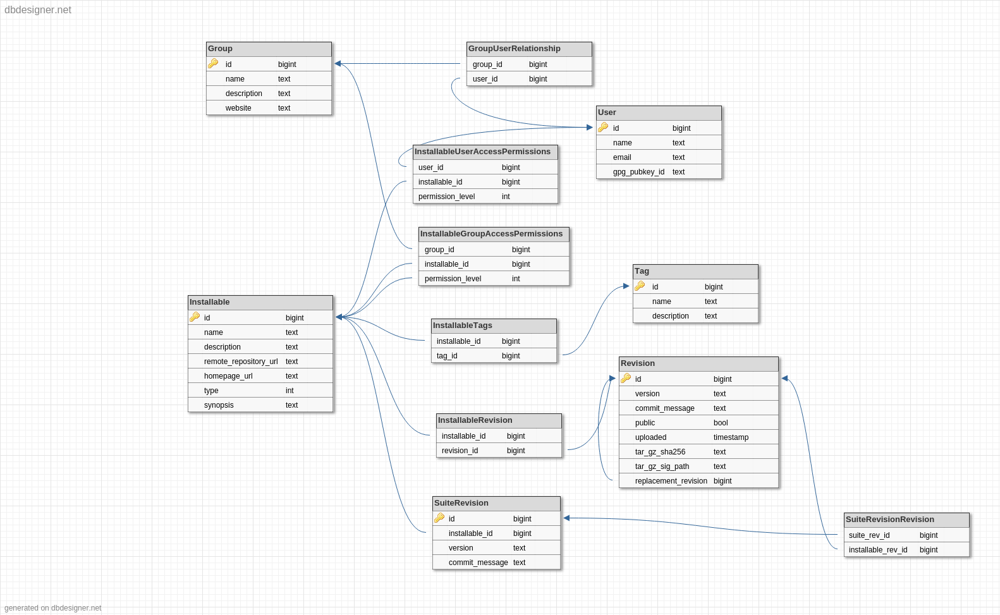

# Galaxy Toolshed

**NOT A HOSTILE REPLACEMENT**

This is a repository exploring the possibility of a replacement toolshed. This
is a personal time, not-as-a-galaxy-committer project. (I.e. I'm trying *very*
hard not to step on any toes.)

The rationale for this is that the existing toolshed codebase is gigantic, full
of spaghetti, hard to maintain, not under test, etc.

For one reason or another existing options were deemed not appropriate to the
Galaxy use case. PyPi lacks the notion of groups and allows deleting (which
would mean syncing the codebase and maintaining a tree of changes), brew
packages aren't appropriate as an upload store (for those not using git/hg on a
publicly accessible webserver), debian packages aren't meant for storing
html+js viz plugins and are wildly complex for this use case.

I wanted something that anyone could understand in under an hour and begin
working on the codebase.

## Schema

Most of the Group/User relationships should be straightforward. We provide for
user specified GPG key IDs/uploaded public keys to allow end users to verify
packages (assuming they trust the toolshed for fetching public keys.)

Installable is the salient point of this image. It represents the old concept
of a "repository" by the old toolshed. An installable is simply a metadata
holder. The type field will be an enum on [Suite, Tool, DataManager, Package,
Viz, GalaxyInteractiveEnvironments]. More can be added as needed. Suites are a
bit of a special case, however they're still considered installables like
everything else.

By convention:

- packages will only have a single installable (though I'm not sure I agree
  with this completely, so via the UI you'll only be able to install the
  latest, but the API won't make that distinction.)
- Tools will have multiple installable versions as will viz plugins (if they're
  ever "saveable" then they're essentially non-rerunable tools.)
- Suites are more like packages in taht they only have one installable revision

Installables have multiple revisions, which represents a single, real,
installable thing. These are stored in the `Revision` table. They have a path
to an on-disk .tar.gz file containing everything needed for that package
(including the `.shed.yml` file or equivalent.) A revision has a version number
and a preferrably git-style commit message saying what has been changed. There
is a public boolean enabling the user to upload private versions of packages
for testing (thereby deprecating the TTS). We will generate a sha256sum on the
server side for uploaded packages (and maybe require on uploader side for
verification?), and allow for user submission of a GPG key signature for a
revision release.

The `replacement_revision` field is of note, this will provide an upgrade path
for deprecated installables. There are a couple ways to handle this and I
haven't settled on one yet. Either we ignore it EXCEPT in the case of
changed-parent-installable "replacements", or we set it on every upload EXCEPT
the latest version of each Revision. TODO.
